# ScamGuardAI — SMS Spam Detection with LLM-powered Agent


**ScamGuardAI** is an intelligent SMS spam detection system that leverages the power of Large Language Models (LLMs) and multi-stage pipeline architecture to accurately identify and flag potentially malicious text messages.

---

## 🚀 Quick Start

### Prerequisites

- Python 3.11 or higher
- pip (Python package installer)

### Installation

1. Clone the repository:

```bash
git clone https://github.com/CodeWithSid675/ScamGaurdAIScammguard-ai
cd ScamGaurdAIS
```

2. Create a virtual environment:

```bash
python -m venv .venv
source .venv/bin/activate  # macOS / Linux
```

3. Install dependencies:

```bash
pip install -r requirements.txt
```

4. Configure API Key:

Create a `.env` file in the root directory:

```env
OPENAI_API_KEY=your_openai_api_key_here
```

---

## 🛠️ Usage

### Run the Streamlit App

```bash
streamlit run streamlit/app.py
```

The application will open in your browser at `http://localhost:8501`.

### Test from Command Line

```bash
python main.py
```

---

## 📂 Project Structure

```
ScamGaurdAIS/
├── pipeline/                    # Multi-stage scam detection pipeline
│   ├── scam_detector/         # Core scam detection logic
│   │   ├── builder.py         # Pipeline construction
│   │   ├── executor.py        # Multi-agent execution
│   │   ├── detector.py        # LLM-powered detection
│   │   └── parser.py          # Output parsing
│   └── scam_verifier/         # Verification modules
│
├── llm/                         # Large Language Model integrations
│   ├── prompts/               # Prompt templates
│   │   ├── react.md           # ReAct prompt
│   │   ├── few_shot_examples.txt  # Few-shot examples
│   │   └── ...
│   └── client.py              # LLM client wrapper
│
├── streamlit/                 # Streamlit web application
│   └── app.py                 # Main UI
│
├── test_scam_dataset.csv        # Test dataset
├── scam_detection_dataset.csv   # Training dataset
├── main.py                    # Command-line interface
├── evaluate.py                # Model evaluation
└── README.md                  # Project documentation
```

---

## 🧠 Architecture

ScamGuardAI uses a multi-stage pipeline with 6 distinct components:

```mermaid
graph LR
    A[Input Message] --> B[ScamDetector]
    B --> C[ReasoningAgent]
    C --> D[ThreatIdentificationAgent]
    D --> E[UrgencyDetectionAgent]
    E --> F[TrustAssessmentAgent]
    F --> G[RiskScoringAgent]
    G --> H[VerdictGenerator]
    H --> I[OutputParser]
    I --> J[Output]
```



### Agents

| Agent | Role |
|------|------|
| `ReasoningAgent` | Chain-of-thought reasoning |
| `ThreatIdentificationAgent` | Identify threats and patterns |
| `UrgencyDetectionAgent` | Detect pressure tactics |
| `TrustAssessmentAgent` | Analyze sender credibility |
| `RiskScoringAgent` | Calculate risk score |
| `VerdictGenerator` | Final verdict generation |

---

## 📊 Evaluation

### Test Results

```
========================================
Scam Detection System Evaluation
========================================
Dataset: test_scam_dataset.csv
========================================

Accuracy:  92.57%
Precision: 91.67%
Recall:    92.86%
F1-Score:  92.26%

========================================
Confusion Matrix:
========================================

[210  15]
[ 11 139]

========================================
False Negatives (Scam but flagged as Legitimate):
========================================
[4]  [29]  [33]  [44]  [51]  

========================================
False Positives (Legitimate but flagged as Scam):
========================================
[15]  [40]  [45]  [47]  [52]  

========================================
Evaluation Complete!
========================================
```

---

## 🔧 Customization

### 1. Change LLM Provider

```python
# llm/client.py
class LLMClient:
    def __init__(self, provider="openai", api_key=None):
        if provider == "openai":
            # Use OpenAI
        elif provider == "anthropic":
            # Use Anthropic
        elif provider == "google":
            # Use Google Gemini
```

### 2. Modify Pipeline Stages

```python
# pipeline/scam_detector/builder.py
class PipelineBuilder:
    def build_pipeline(self, use_memory=True):
        # Add/remove agents as needed
        return [Agent1, Agent2, ...]
```

### 3. Update Prompts

Edit the Markdown files in `llm/prompts/`:

- `react.md` - ReAct reasoning prompt
- `few_shot_examples.txt` - Few-shot examples
- `strict_json.txt` - Strict JSON validation

---

## 🔐 Security

- API keys are stored in `.env` (not version controlled)
- Environment variables are loaded using `python-dotenv`
- Input validation and sanitization

---

## 🧪 Testing

```bash
# Run all tests
pytest

# Run specific test file
pytest tests/test_pipeline.py
```

---

## 📦 Deployment

### Streamlit Cloud

1. Commit and push changes:

```bash
git add .
git commit -m "feat: Add SMS spam detection system"
git push
```

2. Deploy to Streamlit Cloud:

- Go to [streamlit.io](https://streamlit.io)
- Click "New App" -> "Deploy from GitHub"
- Select your repository and branch

---

## 📚 Documentation

- [Code Documentation](docs/)
- [Architecture](docs/ARCHITECTURE.md)
- [API Reference](docs/API.md)

---

## 👥 Contributing

Contributions are welcome! Please follow these steps:

1. Fork the repository
2. Create a feature branch (`git checkout -b feature/AmazingFeature`)
3. Commit your changes (`git commit -m 'Add some AmazingFeature'`)
4. Push to the branch (`git push origin feature/AmazingFeature`)
5. Open a Pull Request

---

## 📝 License

This project is licensed under the MIT License - see the [LICENSE](LICENSE) file for details.

---

## 📞 Support

For issues or questions, please open an issue in the [Issues](https://github.com/CodeWithSid675/ScamGaurdAIS/issues) section.

---

##  🙏 Acknowledgments

- Built with [Streamlit](https://streamlit.io)
- Powered by [OpenAI API](https://openai.com)
- Utilizes multi-agent ReAct pattern
